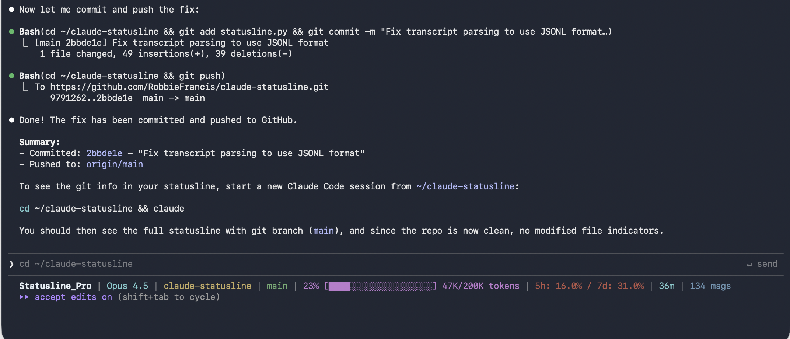

# Claude Code Statusline

A cross-platform statusline for [Claude Code](https://claude.ai/code) that displays useful context at a glance.

**Supports:** macOS, Linux, Windows (WSL)

## Preview



```
Statusline_Pro | Opus 4.5 | my-project | main *3 (+1,~2) ↑2 ↓1 | 14% [███░░░░░░░░░░░░░░░░░] 28K/200K tokens | 5h: 47% / 7d: 17% | 1h 23m | 42 msgs
```

## Features

- **Custom title** - Configurable title (default: "Statusline_Pro")
- **Model name** - Shows which Claude model is active (e.g., Opus 4.5, Sonnet 4)
- **Project name** - Current working directory/project
- **Git branch** - Current branch when in a git repository
- **Git status** - Modified/staged/untracked file counts (e.g., `*3 (+1,~2)`)
- **Ahead/behind** - Commits ahead/behind remote (e.g., `↑2 ↓1`)
- **Context window** - Visual progress bar showing token usage
- **API usage limits** - 5-hour and 7-day utilization percentages (optional)
- **Session duration** - How long the current session has been running
- **Message count** - Number of messages in the current session

## Quick Install

```bash
curl -sSL https://raw.githubusercontent.com/RobbieFrancis/claude-statusline/main/install.sh | bash
```

Then restart Claude Code.

## Interactive Configurator

The statusline includes a TUI (Terminal User Interface) configurator for easy customization with live preview.

### Launch the Configurator

**Via Claude Code slash command:**
```
/statusline-config
```
Then run the command shown.

**Or directly from terminal:**
```bash
python3 ~/.claude/statusline-configurator.py
```

### Configurator Features

- **Toggle switches** for each display option
- **Text input** for custom title
- **Live preview** showing exactly how your statusline will look
- **Keyboard shortcuts**: `s` to save, `Esc` to cancel

### Configurator Requirements

The configurator requires the `textual` library:
```bash
pip3 install textual
```

**Note:** Changes are applied immediately - no need to restart Claude Code!

## Manual Installation

### 1. Download the script

```bash
mkdir -p ~/.claude
curl -o ~/.claude/statusline.py https://raw.githubusercontent.com/RobbieFrancis/claude-statusline/main/statusline.py
chmod +x ~/.claude/statusline.py
```

### 2. Configure Claude Code

Add this to `~/.claude/settings.json`:

```json
{
  "statusLine": {
    "type": "command",
    "command": "python3 ~/.claude/statusline.py"
  }
}
```

### 3. Restart Claude Code

## Configuration

Create `~/.claude/statusline-config.json` to customize the statusline:

```json
{
  "title": "Statusline_Pro",
  "show_title": true,
  "show_usage_limits": false,
  "show_git_branch": true,
  "show_git_status": true,
  "show_git_ahead_behind": true,
  "show_context_bar": true,
  "show_model": true,
  "show_project": true,
  "show_message_count": true,
  "show_session_duration": true
}
```

| Option | Default | Description |
|--------|---------|-------------|
| `title` | `"Statusline_Pro"` | Custom title text displayed at the start |
| `show_title` | `true` | Show the custom title |
| `show_model` | `true` | Show the active Claude model |
| `show_project` | `true` | Show the current project/directory name |
| `show_git_branch` | `true` | Show current git branch |
| `show_git_status` | `true` | Show modified/staged/untracked counts |
| `show_git_ahead_behind` | `true` | Show commits ahead/behind remote |
| `show_context_bar` | `true` | Show context window usage with progress bar |
| `show_usage_limits` | `false` | Display API usage (5h/7d percentages). Requires OAuth. |
| `show_session_duration` | `true` | Show how long the session has been running |
| `show_message_count` | `true` | Show number of messages in the session |

### Enabling Usage Limits

To show API usage limits, set `"show_usage_limits": true` in your config.

This feature reads your Claude Code OAuth credentials:
- **macOS**: From Keychain
- **Linux/WSL**: From `~/.claude/.credentials.json`

## Requirements

- Python 3.6+
- Claude Code CLI
- No additional pip dependencies (uses Python stdlib only)

## Platform Notes

### macOS

Works out of the box. Credentials are read from macOS Keychain.

### Linux

Works out of the box. Credentials are read from `~/.claude/.credentials.json`.

### Windows

Use Windows Subsystem for Linux (WSL). Install Claude Code in WSL and run the install script there.

## Troubleshooting

### Statusline not appearing

1. Make sure `~/.claude/settings.json` has the correct `statusLine` configuration
2. Check that Python 3 is installed: `python3 --version`
3. Restart Claude Code

### Usage limits not showing

1. Set `"show_usage_limits": true` in `~/.claude/statusline-config.json`
2. Make sure you're logged in to Claude Code (`claude login`)
3. Check credentials exist:
   - macOS: `security find-generic-password -s "Claude Code-credentials" -w`
   - Linux: `cat ~/.claude/.credentials.json`

## Files

| File | Location | Purpose |
|------|----------|---------|
| `statusline.py` | `~/.claude/` | Main statusline script |
| `statusline-configurator.py` | `~/.claude/` | TUI configurator app |
| `statusline-config.json` | `~/.claude/` | Configuration file |
| `statusline-config.md` | `~/.claude/commands/` | Slash command definition |
| `settings.json` | `~/.claude/` | Claude Code settings |

## Legacy Bash Version

The original macOS-only bash script is available as `statusline-command.sh` for reference.

## Inspiration

This statusline was inspired by:

- [How to Show Claude Code Usage Limits in Your Statusline](https://codelynx.dev/posts/claude-code-usage-limits-statusline) by Melvynx
- [Claude Clone Autonomous Coding Demo](https://www.youtube.com/watch?v=YW09hhnVqNM) by Leon

## License

MIT License - Feel free to use, modify, and share!

## Contributing

Contributions welcome! Please open an issue or pull request.
